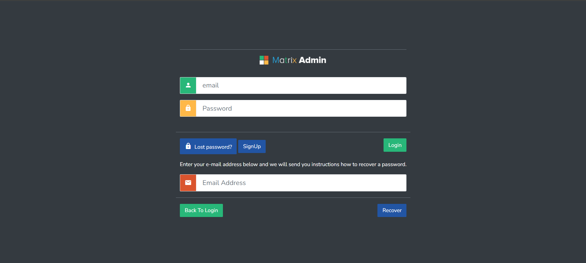
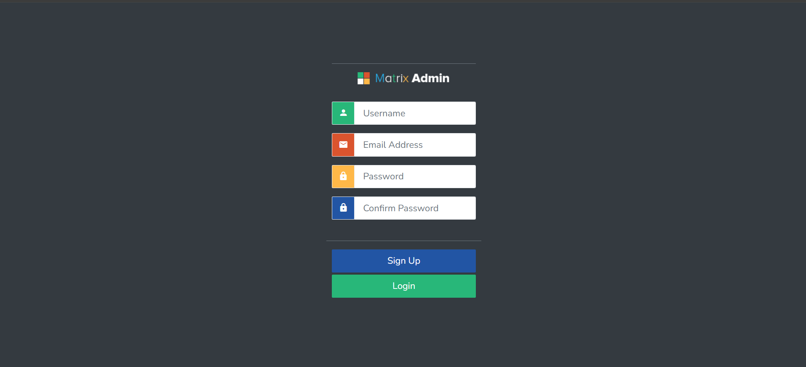
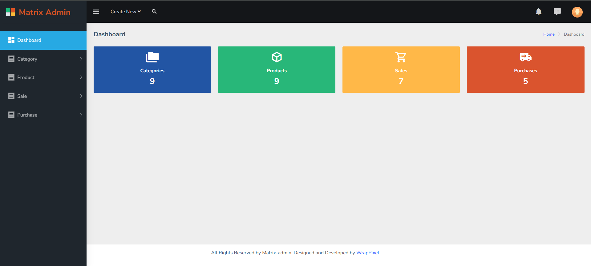
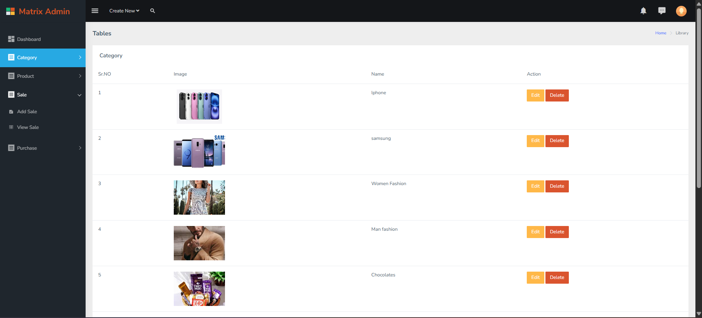
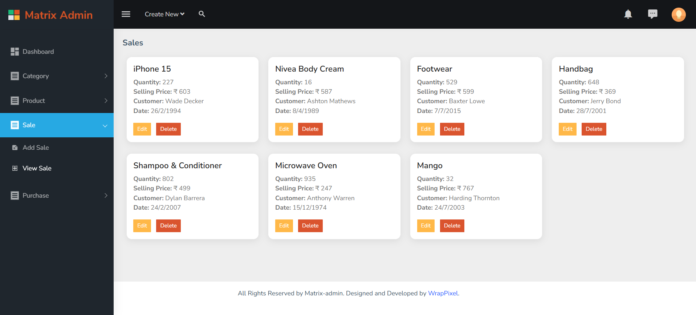
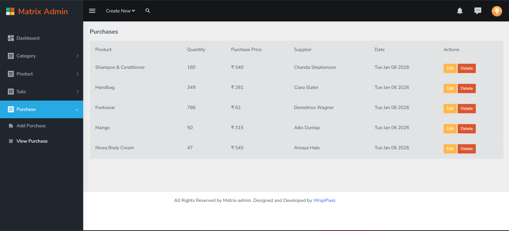
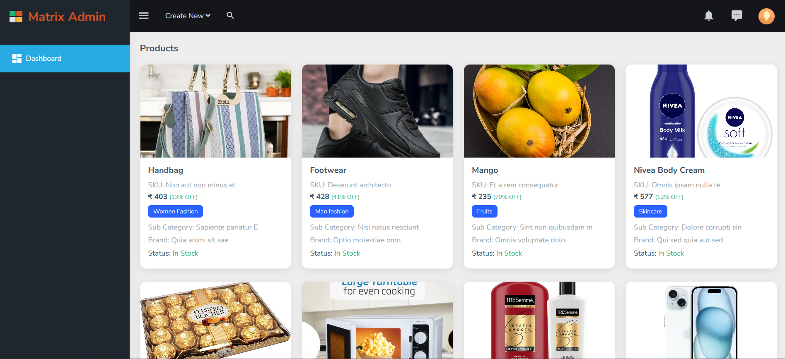

# 🛒 Product Management System (Node.js + Express + MongoDB)

A full-stack **Product Management System** built using **Node.js, Express, MongoDB, and EJS**.  
This application supports **Admin and User roles**, product management, categories, sales, and purchases.

---

## 📌 Features

### Admin Panel
- Admin authentication
- Manage products (Add / Edit / Delete)
- Manage categories
- Manage users
- View sales and purchases

### User Panel
- User authentication
- View products
- View categories
- User profile access

---

## 🔐 Default Login Credentials 

### 👨‍💼 Admin Login
- **Email:** `admin@gmail.com`
- **Password:** `1234`

### 👤 User Login
- **Email:** `user@gmail.com`
- **Password:** `1234`

---

## 🌐 Live Project Link

🔗 **Live Demo:**  
```
[https://pr-13-product-management-system.onrender.com](https://pr-13-product-management-system.onrender.com)
```

---

## 📂 Project Structure

```
PR-13-PRODUCT-MANAGEMENT
│
├── configs
│   └── db.js
│
├── controllers
│   ├── admin.controller.js
│   ├── category.controller.js
│   ├── client.controller.js
│   ├── product.controller.js
│   ├── purchase.controller.js
│   └── sale.controller.js
│
├── middlewares
│   ├── imageUpload.js
│   └── userAuth.js
│
├── models
│   ├── category.model.js
│   ├── product.model.js
│   ├── purchase.model.js
│   ├── sale.model.js
│   ├── user.model.js
│   └── role.model.js
│
├── routes
│   ├── admin.routes.js
│   ├── category.routes.js
│   ├── index.js
│   ├── product.routes.js
│   ├── purchase.routes.js
│   ├── sale.routes.js
│   └── user.routes.js
│
├── uploads
├── views
├── .env.example
├── index.js
├── package.json
└── README.md
```

---

## ⚙️ Installation & Setup

1. Clone the repository
```bash
<<<<<<< HEAD
git clone https://github.com/your-username/PR-13-Product-Management-System.git
=======
git clone https://github.com/devanshi78/PR-13-Product-Management-System
>>>>>>> 69e0245ce49a0e007a283c3240d45b543e249c0c
```

2. Install dependencies
```bash
npm install
```

3. Create `.env` file
```env
PORT=3000
MONGO_URI=your_mongodb_connection_string
JWT_SECRET=your_jwt_secret_key
```

4. Start the server
```bash
npm start
```

---

## 🖼️ Screenshots

### 🔐 Admin Panel

#### ✅ Admin Login Page


#### ✅ Admin Signup Page


#### ✅ Dashboard Page


#### ✅ View Categories


#### ✅ View Products


#### ✅ View Sales


#### ✅ View Purchases


---

### 👤 User Panel

#### 🛍️ View Products


---

## 🛠️ Technologies Used
- Node.js
- Express.js
- MongoDB
- Mongoose
- EJS
- Bootstrap

---

## ✨ Author

**Devanshi Parekh**

## 📄 License


This project is for **learning and educational purposes**.
